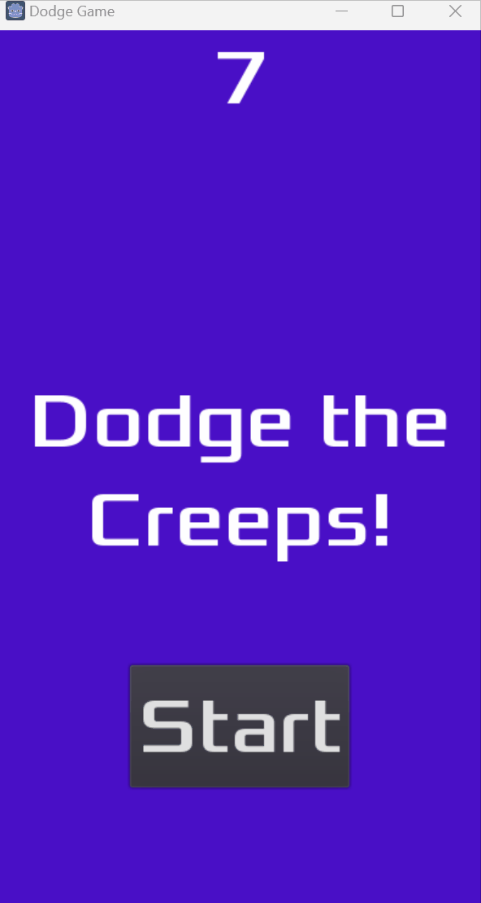

# Christopher J Pishaki Portfolio - WoW-Inspired Design Specification

## Executive Summary
This design specification transforms blamechris.github.io into a modern, professional portfolio with World of Warcraft aesthetic influences. The design balances epic fantasy elements with the credibility required for a software engineering portfolio, creating a memorable and distinctive online presence.

---

## 1. Design Philosophy

### Core Principles
- **Epic Yet Professional**: Draw from WoW's legendary UI design while maintaining corporate-level professionalism
- **Dark & Sophisticated**: Deep backgrounds with strategic lighting and metallic accents
- **Clarity First**: Fantasy elements enhance, never obscure, the content
- **Responsive Excellence**: Flawless experience across all devices
- **Performance Optimized**: Fast loading, smooth animations, GitHub Pages compatible

### WoW Elements to Adapt
- **Tooltip System**: Rich, bordered tooltips for skill/tech hover states
- **Quest Log Aesthetic**: Card-based project layouts resembling quest entries
- **Character Sheet Design**: Skills section mimicking talent trees/stats
- **Achievement Style**: Professional accomplishments presented as "achievements"
- **Material Design**: Stone, metal, and leather textures (subtle, modern interpretations)
- **Glow Effects**: Strategic use of subtle glows for CTAs and interactive elements

---

## 2. Color Palette

### Primary Colors
```
Deep Azeroth Navy:     #0a0e27   /* Main background */
Midnight Stone:        #1a1d2e   /* Secondary background, cards */
Slate Shadow:          #2a2d3e   /* Tertiary background, elevated cards */
```

### Accent Colors
```
Legendary Gold:        #ffd700   /* Primary accent, headings, CTAs */
Epic Purple:           #a335ee   /* Secondary accent, links, highlights */
Rare Blue:             #0070dd   /* Tertiary accent, tech badges */
Uncommon Green:        #1eff00   /* Success states, skill proficiency */
```

### Metallic Accents
```
Bronze Border:         #cd7f32   /* Card borders, dividers */
Silver Shimmer:        #c0c0c0   /* Secondary borders, subtle accents */
Dark Bronze:           #8b6914   /* Hover states for gold elements */
```

### Neutral Palette
```
Parchment White:       #f5f1e8   /* Primary text */
Stone Gray:            #b8b8b8   /* Secondary text */
Shadow Gray:           #6a6a6a   /* Tertiary text, disabled states */
Pure Black:            #000000   /* Deep shadows, overlays */
```

### Semantic Colors
```
Success:               #1eff00   /* Uncommon Green */
Warning:               #ff8000   /* Orange (not in WoW rarity, but needed) */
Error:                 #ff0000   /* Red */
Info:                  #0070dd   /* Rare Blue */
```

### Gradient Definitions
```css
--gradient-hero: linear-gradient(135deg, #0a0e27 0%, #1a1d2e 50%, #2a2d3e 100%);
--gradient-gold: linear-gradient(135deg, #ffd700 0%, #ffed4e 50%, #ffd700 100%);
--gradient-card: linear-gradient(180deg, #1a1d2e 0%, #0f1119 100%);
--glow-gold: 0 0 20px rgba(255, 215, 0, 0.3);
--glow-epic: 0 0 20px rgba(163, 53, 238, 0.3);
--glow-rare: 0 0 20px rgba(0, 112, 221, 0.3);
```

---

## 3. Typography System

### Font Selections (Google Fonts)

**Primary Heading Font**: `Cinzel` (serif, elegant, fantasy-appropriate)
```
@import url('https://fonts.googleapis.com/css2?family=Cinzel:wght@400;600;700;900&display=swap');
```
- H1 (Hero Title): 900 weight
- H2 (Section Headers): 700 weight
- H3 (Subsections): 600 weight

**Secondary Heading Font**: `Marcellus` (serif, refined)
```
@import url('https://fonts.googleapis.com/css2?family=Marcellus&display=swap');
```
- Alternative for specific sections (About Me heading)

**Body Font**: `Lato` (sans-serif, professional, highly readable)
```
@import url('https://fonts.googleapis.com/css2?family=Lato:wght@300;400;700;900&display=swap');
```
- Body: 400 weight
- Bold: 700 weight
- Light: 300 weight (subtitles)

**Monospace Font**: `Fira Code` (code snippets, tech elements)
```
@import url('https://fonts.googleapis.com/css2?family=Fira+Code:wght@400;500;600&display=swap');
```

### Typography Scale
```css
/* Desktop */
--font-size-hero: 5rem;        /* 80px - Main name on hero */
--font-size-h1: 3.5rem;        /* 56px - Page titles */
--font-size-h2: 2.5rem;        /* 40px - Section headers */
--font-size-h3: 1.75rem;       /* 28px - Subsection headers */
--font-size-h4: 1.25rem;       /* 20px - Card titles */
--font-size-body: 1.125rem;    /* 18px - Body text */
--font-size-small: 0.875rem;   /* 14px - Small text */
--font-size-tiny: 0.75rem;     /* 12px - Labels, metadata */

/* Mobile Adjustments */
@media (max-width: 768px) {
  --font-size-hero: 2.5rem;    /* 40px */
  --font-size-h1: 2rem;        /* 32px */
  --font-size-h2: 1.5rem;      /* 24px */
  --font-size-h3: 1.25rem;     /* 20px */
  --font-size-body: 1rem;      /* 16px */
}
```

### Line Height & Spacing
```css
--line-height-tight: 1.2;      /* Headings */
--line-height-normal: 1.6;     /* Body text */
--line-height-loose: 1.8;      /* Long-form content */

--letter-spacing-tight: -0.02em;   /* Large headings */
--letter-spacing-normal: 0;         /* Body text */
--letter-spacing-wide: 0.05em;      /* All-caps labels */
```

---

## 4. Layout Structure

### 4.1 Landing Page (index.html)

#### Hero Section
```
┌─────────────────────────────────────────────────────────┐
│  [Logo/Tagline]                         [Nav Menu]      │
├─────────────────────────────────────────────────────────┤
│                                                          │
│                   CHRISTOPHER J PISHAKI                  │
│                                                          │
│              Software Engineer • AI Tooling              │
│                                                          │
│                    [Legendary Border]                    │
│                                                          │
│          [View Projects] [Contact Me] [Resume]           │
│                                                          │
│                    ↓ Scroll to Explore                  │
└─────────────────────────────────────────────────────────┘
```

**Design Details**:
- **Full viewport height** with gradient background
- **Name in Cinzel 900**, gold gradient text effect with subtle glow
- **Legendary border**: Animated golden border effect around name (CSS animation)
- **Subtitle in Lato 300**, silver color
- **CTA Buttons**: WoW-style buttons (see Button Design section)
- **Scroll indicator**: Animated downward chevron with Epic Purple glow

#### Quick Stats Section (Below Hero)
```
┌─────────────────────────────────────────────────────────┐
│  ┌───────────┐   ┌───────────┐   ┌───────────┐         │
│  │   [Icon]  │   │   [Icon]  │   │   [Icon]  │         │
│  │   2+      │   │    10+    │   │   React   │         │
│  │   Years   │   │  Projects │   │   Python  │         │
│  │   Exp     │   │ Completed │   │   Java    │         │
│  └───────────┘   └───────────┘   └───────────┘         │
└─────────────────────────────────────────────────────────┘
```

**Design Details**:
- Three stat cards with bronze borders
- Icon at top (Font Awesome or custom SVG)
- Large number in Legendary Gold
- Label in Stone Gray
- Subtle hover animation (lift + glow)

---

### 4.2 About Me Page

#### Hero Banner (Reduced Height)
```
┌─────────────────────────────────────────────────────────┐
│  [Navigation Bar - Sticky]                              │
├─────────────────────────────────────────────────────────┤
│                                                          │
│              CHRISTOPHER J PISHAKI                       │
│         Software Engineer • Enthusiastic Human           │
│                                                          │
└─────────────────────────────────────────────────────────┘
```

#### Biography Section
```
┌─────────────────────────────────────────────────────────┐
│  ┌─────────────────────┐  ┌──────────────────────────┐ │
│  │                     │  │  [Profile Area]          │ │
│  │  Profile Image/     │  │  "Christopher J Pishaki" │ │
│  │  Avatar Frame       │  │  Software Engineer       │ │
│  │  (WoW Character     │  │                          │ │
│  │   Sheet Style)      │  │  2+ Years Experience     │ │
│  │                     │  │  [Social Links Row]      │ │
│  └─────────────────────┘  └──────────────────────────┘ │
│                                                          │
│  ┌───────────────────────────────────────────────────┐  │
│  │  [Biography Text]                                 │  │
│  │  Multi-paragraph description with proper spacing │  │
│  │  and line height for readability                 │  │
│  └───────────────────────────────────────────────────┘  │
└─────────────────────────────────────────────────────────┘
```

#### Quote Section
```
┌─────────────────────────────────────────────────────────┐
│  ╔═══════════════════════════════════════════════════╗  │
│  ║  "And so I found myself embarrassed with so many  ║  │
│  ║  doubts and errors..."                            ║  │
│  ║                              - René Descartes     ║  │
│  ╚═══════════════════════════════════════════════════╝  │
└─────────────────────────────────────────────────────────┘
```

**Design Details**:
- Quote in tooltip-style box with bronze borders
- Parchment-like background color
- Italicized text in Lato 300

---

### 4.3 Projects Page

#### Project Grid Layout
```
┌─────────────────────────────────────────────────────────┐
│                      PROJECTS                            │
│              Legendary Achievements Unlocked             │
├─────────────────────────────────────────────────────────┤
│  ┌───────────────────────┐  ┌────────────────────────┐ │
│  │  [AULMA Project Card] │  │  [IRP Project Card]    │ │
│  │  ╔═══════════════════╗ │  │  ╔══════════════════╗ │ │
│  │  ║ [Epic]  API Usage ║ │  │  ║ [Rare] Report    ║ │ │
│  │  ║ Logging System    ║ │  │  ║ Processor        ║ │ │
│  │  ╚═══════════════════╝ │  │  ╚══════════════════╝ │ │
│  │  [Tech Badges Row]    │  │  [Tech Badges Row]     │ │
│  │  [Description...]     │  │  [Description...]      │ │
│  │  [View Details →]     │  │  [View Details →]      │ │
│  └───────────────────────┘  └────────────────────────┘ │
│  ┌───────────────────────┐                              │
│  │  [Dodging Game Card]  │                              │
│  │  ╔═══════════════════╗ │                              │
│  │  ║ [Uncommon] Game   ║ │                              │
│  │  ║ Development       ║ │                              │
│  │  ╚═══════════════════╝ │                              │
│  │  [Tech Badges Row]    │                              │
│  │  [GIF Preview]        │                              │
│  │  [View Demo →]        │                              │
│  └───────────────────────┘                              │
└─────────────────────────────────────────────────────────┘
```

**Design Details**:
- **WoW Quest Log Aesthetic**: Each card resembles a quest/achievement entry
- **Rarity Classification**: Projects tagged as Epic, Rare, Uncommon with corresponding color accents
- **Card Structure**:
  - Bronze border with rarity-colored top border (3px solid)
  - Gradient background (--gradient-card)
  - Title in Cinzel 600, rarity color
  - Tech badges as small rounded pills (similar to WoW buff icons)
  - Description in Lato 400
  - CTA button at bottom
- **Hover Effect**: Card lifts (translateY(-8px)), border glow intensifies
- **Grid**: CSS Grid, 2 columns desktop, 1 column mobile

---

### 4.4 Experience/Skills Section (New Addition)

#### Skills Talent Tree Layout
```
┌─────────────────────────────────────────────────────────┐
│                    SKILL ARSENAL                         │
│                 Mastered Technologies                    │
├─────────────────────────────────────────────────────────┤
│  ┌─────────────────┐  ┌─────────────────┐               │
│  │   LANGUAGES     │  │   FRAMEWORKS    │               │
│  │  ◆ Python ████  │  │  ◆ React ████   │               │
│  │  ◆ Java   ████  │  │  ◆ Spring ███   │               │
│  │  ◆ JS/TS  ███   │  │  ◆ Kafka  ███   │               │
│  └─────────────────┘  └─────────────────┘               │
│  ┌─────────────────┐  ┌─────────────────┐               │
│  │   TOOLS         │  │   CLOUD/DB      │               │
│  │  ◆ Git    ████  │  │  ◆ AWS    ███   │               │
│  │  ◆ Docker ███   │  │  ◆ BigQuery ██  │               │
│  └─────────────────┘  └─────────────────┘               │
└─────────────────────────────────────────────────────────┘
```

**Design Details**:
- **Category Cards**: Each category in its own bordered card
- **Skill Items**:
  - Skill name in Lato 700
  - Progress bar (5-block system like WoW talent points)
  - Filled blocks in rarity colors (green for mastered, blue for proficient, purple for learning)
- **Hover Tooltips**: WoW-style tooltips appear with details:
  - Years of experience
  - Notable projects using this skill
  - Certification/achievement dates

#### Timeline Section (Work Experience)
```
┌─────────────────────────────────────────────────────────┐
│                  LEGENDARY QUESTS                        │
│                 Professional Journey                     │
├─────────────────────────────────────────────────────────┤
│  ●───────────────────────────────────────────────────   │
│  │                                                        │
│  ├─ [2023-Present] Software Engineer II                  │
│  │  Company Name                                         │
│  │  • Achievement 1                                      │
│  │  • Achievement 2                                      │
│  │                                                        │
│  ├─ [2021-2023] Software Engineer I                      │
│  │  Company Name                                         │
│  │  • Achievement 1                                      │
│  │  • Achievement 2                                      │
│  │                                                        │
│  └─ [2020-2021] Intern - NASA JPL                        │
│     • IRP Development                                    │
│     • Testbed Support                                    │
└─────────────────────────────────────────────────────────┘
```

**Design Details**:
- Vertical timeline with gold connecting line
- Each position is a card that intersects the timeline
- Cards have bronze borders and gradient backgrounds
- Achievement bullets use uncommon green diamonds (◆)
- Dates in Legendary Gold

---

### 4.5 Navigation System

#### Sticky Header (All Pages)
```
┌─────────────────────────────────────────────────────────┐
│  Overthinking is a Way of Life    [About][Projects][Contact] │
└─────────────────────────────────────────────────────────┘
```

**Design Details**:
- **Height**: 70px desktop, 60px mobile
- **Background**: Semi-transparent Midnight Stone (#1a1d2e with 95% opacity)
- **Backdrop Filter**: Blur effect for modern glass-morphism
- **Border Bottom**: 2px solid Bronze (#cd7f32)
- **Logo/Tagline**: Left-aligned, Lato 400, Legendary Gold
- **Nav Links**: Right-aligned, Lato 700, uppercase, letter-spacing: 0.05em
  - Default: Stone Gray
  - Hover: Legendary Gold with text-shadow glow
  - Active: Epic Purple underline (3px)
- **Mobile**: Hamburger menu icon (three horizontal bars)
  - Expands to full-screen overlay menu
  - Menu items vertically stacked, centered
  - Each item in large Cinzel font

---

## 5. Component Design Specifications

### 5.1 Buttons

#### Primary Button (CTA)
```css
.btn-legendary {
  /* Structure */
  padding: 16px 40px;
  border: 2px solid var(--legendary-gold);
  border-radius: 4px;

  /* Typography */
  font-family: 'Cinzel', serif;
  font-size: 1rem;
  font-weight: 700;
  letter-spacing: 0.05em;
  text-transform: uppercase;
  color: var(--deep-navy);

  /* Visual */
  background: linear-gradient(135deg, #ffd700 0%, #ffed4e 50%, #ffd700 100%);
  box-shadow:
    0 4px 15px rgba(255, 215, 0, 0.3),
    inset 0 1px 0 rgba(255, 255, 255, 0.3);
  cursor: pointer;
  transition: all 0.3s cubic-bezier(0.4, 0, 0.2, 1);

  /* Hover State */
  &:hover {
    transform: translateY(-2px);
    box-shadow:
      0 6px 20px rgba(255, 215, 0, 0.5),
      inset 0 1px 0 rgba(255, 255, 255, 0.3);
    background: var(--legendary-gold);
  }

  /* Active State */
  &:active {
    transform: translateY(0);
  }
}
```

#### Secondary Button
```css
.btn-epic {
  /* Same structure as legendary but with Epic Purple colors */
  border: 2px solid var(--epic-purple);
  background: transparent;
  color: var(--epic-purple);

  &:hover {
    background: var(--epic-purple);
    color: var(--parchment-white);
    box-shadow: 0 0 20px rgba(163, 53, 238, 0.5);
  }
}
```

#### Tertiary Button (Ghost)
```css
.btn-ghost {
  border: 1px solid var(--bronze-border);
  background: transparent;
  color: var(--parchment-white);
  padding: 12px 32px;

  &:hover {
    border-color: var(--legendary-gold);
    color: var(--legendary-gold);
    background: rgba(255, 215, 0, 0.05);
  }
}
```

---

### 5.2 Project Cards

```css
.project-card {
  /* Structure */
  position: relative;
  padding: 0;
  border: 2px solid var(--bronze-border);
  border-radius: 8px;
  overflow: hidden;

  /* Visual */
  background: var(--gradient-card);
  transition: all 0.4s cubic-bezier(0.4, 0, 0.2, 1);

  /* Rarity Top Border */
  &::before {
    content: '';
    position: absolute;
    top: 0;
    left: 0;
    right: 0;
    height: 4px;
    background: var(--rarity-color); /* Epic, Rare, or Uncommon */
    box-shadow: 0 0 15px var(--rarity-color);
  }

  /* Hover State */
  &:hover {
    transform: translateY(-8px);
    border-color: var(--rarity-color);
    box-shadow:
      0 8px 30px rgba(0, 0, 0, 0.5),
      0 0 30px var(--rarity-glow);
  }
}

.project-card-header {
  padding: 24px 24px 16px;
  border-bottom: 1px solid rgba(205, 127, 50, 0.3);

  .rarity-badge {
    display: inline-block;
    padding: 4px 12px;
    border-radius: 12px;
    font-family: 'Lato', sans-serif;
    font-size: 0.75rem;
    font-weight: 700;
    text-transform: uppercase;
    letter-spacing: 0.05em;
    background: rgba(var(--rarity-rgb), 0.2);
    color: var(--rarity-color);
    border: 1px solid var(--rarity-color);
  }

  .project-title {
    margin-top: 12px;
    font-family: 'Cinzel', serif;
    font-size: 1.5rem;
    font-weight: 700;
    color: var(--parchment-white);
  }
}

.project-card-body {
  padding: 20px 24px;

  .tech-badges {
    display: flex;
    flex-wrap: wrap;
    gap: 8px;
    margin-bottom: 16px;

    .tech-badge {
      padding: 6px 12px;
      background: var(--rare-blue);
      border: 1px solid rgba(0, 112, 221, 0.5);
      border-radius: 4px;
      font-size: 0.75rem;
      font-weight: 700;
      font-family: 'Fira Code', monospace;
      color: var(--parchment-white);
    }
  }

  .project-description {
    font-family: 'Lato', sans-serif;
    font-size: 1rem;
    line-height: 1.6;
    color: var(--stone-gray);
  }
}

.project-card-footer {
  padding: 16px 24px;
  border-top: 1px solid rgba(205, 127, 50, 0.3);
  display: flex;
  justify-content: space-between;
  align-items: center;
}
```

---

### 5.3 WoW-Style Tooltips

```css
.tooltip {
  position: absolute;
  z-index: 1000;
  padding: 12px 16px;
  min-width: 200px;
  max-width: 350px;

  /* WoW Tooltip Styling */
  background: linear-gradient(180deg, #1a1a1a 0%, #0a0a0a 100%);
  border: 2px solid var(--bronze-border);
  border-radius: 4px;
  box-shadow:
    0 4px 20px rgba(0, 0, 0, 0.8),
    inset 0 1px 0 rgba(205, 127, 50, 0.3);

  /* Typography */
  font-family: 'Lato', sans-serif;
  font-size: 0.875rem;
  color: var(--parchment-white);

  .tooltip-header {
    font-weight: 700;
    color: var(--rarity-color); /* Changes based on item rarity */
    margin-bottom: 8px;
    padding-bottom: 8px;
    border-bottom: 1px solid rgba(205, 127, 50, 0.3);
  }

  .tooltip-stat {
    display: flex;
    justify-content: space-between;
    margin: 4px 0;
    color: var(--stone-gray);

    .stat-value {
      color: var(--uncommon-green);
      font-weight: 700;
    }
  }

  .tooltip-description {
    margin-top: 8px;
    padding-top: 8px;
    border-top: 1px solid rgba(205, 127, 50, 0.3);
    font-style: italic;
    color: var(--legendary-gold);
    font-size: 0.8rem;
  }

  /* Arrow */
  &::after {
    content: '';
    position: absolute;
    bottom: -6px;
    left: 50%;
    transform: translateX(-50%);
    width: 0;
    height: 0;
    border-left: 6px solid transparent;
    border-right: 6px solid transparent;
    border-top: 6px solid var(--bronze-border);
  }
}
```

**Tooltip Usage Example**:
When hovering over a skill badge:
```
╔═══════════════════════════╗
║ Python                    ║
║───────────────────────────║
║ Experience: 5 years       ║
║ Proficiency: ████████ 90% ║
║───────────────────────────║
║ "A versatile language for ║
║  AI tooling and backend   ║
║  development"             ║
╚═══════════════════════════╝
```

---

### 5.4 Hero Section Animation

```css
.hero-section {
  position: relative;
  min-height: 100vh;
  display: flex;
  flex-direction: column;
  justify-content: center;
  align-items: center;
  background: var(--gradient-hero);
  overflow: hidden;

  /* Animated Background Pattern */
  &::before {
    content: '';
    position: absolute;
    top: 0;
    left: 0;
    right: 0;
    bottom: 0;
    background-image:
      repeating-linear-gradient(
        45deg,
        transparent,
        transparent 100px,
        rgba(255, 215, 0, 0.02) 100px,
        rgba(255, 215, 0, 0.02) 200px
      );
    animation: slidePattern 60s linear infinite;
  }
}

@keyframes slidePattern {
  0% { transform: translateX(-200px) translateY(-200px); }
  100% { transform: translateX(0) translateY(0); }
}

.hero-name {
  font-family: 'Cinzel', serif;
  font-size: var(--font-size-hero);
  font-weight: 900;
  letter-spacing: -0.02em;
  text-align: center;

  /* Gradient Text Effect */
  background: var(--gradient-gold);
  -webkit-background-clip: text;
  -webkit-text-fill-color: transparent;
  background-clip: text;

  /* Text Shadow for Depth */
  filter: drop-shadow(0 4px 20px rgba(255, 215, 0, 0.5));

  /* Entrance Animation */
  animation: heroEntrance 1.2s cubic-bezier(0.4, 0, 0.2, 1) forwards;
  opacity: 0;
}

@keyframes heroEntrance {
  0% {
    opacity: 0;
    transform: translateY(-30px) scale(0.95);
  }
  100% {
    opacity: 1;
    transform: translateY(0) scale(1);
  }
}

.hero-subtitle {
  font-family: 'Lato', sans-serif;
  font-size: 1.5rem;
  font-weight: 300;
  color: var(--silver-shimmer);
  margin-top: 16px;
  animation: heroEntrance 1.2s 0.3s cubic-bezier(0.4, 0, 0.2, 1) forwards;
  opacity: 0;
}

/* Legendary Border Around Name */
.legendary-border {
  position: absolute;
  width: 600px;
  height: 200px;
  border: 3px solid var(--legendary-gold);
  border-radius: 8px;
  pointer-events: none;

  /* Animated Glow */
  box-shadow:
    0 0 20px rgba(255, 215, 0, 0.3),
    inset 0 0 20px rgba(255, 215, 0, 0.1);
  animation: borderPulse 3s ease-in-out infinite;

  /* Corner Decorations */
  &::before,
  &::after {
    content: '';
    position: absolute;
    width: 20px;
    height: 20px;
    border: 3px solid var(--legendary-gold);
  }

  &::before {
    top: -10px;
    left: -10px;
    border-right: none;
    border-bottom: none;
  }

  &::after {
    bottom: -10px;
    right: -10px;
    border-left: none;
    border-top: none;
  }
}

@keyframes borderPulse {
  0%, 100% {
    box-shadow:
      0 0 20px rgba(255, 215, 0, 0.3),
      inset 0 0 20px rgba(255, 215, 0, 0.1);
  }
  50% {
    box-shadow:
      0 0 40px rgba(255, 215, 0, 0.6),
      inset 0 0 30px rgba(255, 215, 0, 0.2);
  }
}
```

---

### 5.5 Scroll-Triggered Animations

```css
/* Elements fade and slide in when scrolled into view */
.animate-on-scroll {
  opacity: 0;
  transform: translateY(30px);
  transition: all 0.8s cubic-bezier(0.4, 0, 0.2, 1);
}

.animate-on-scroll.is-visible {
  opacity: 1;
  transform: translateY(0);
}

/* Stagger animation for card grids */
.project-card {
  animation-delay: calc(var(--card-index) * 0.1s);
}
```

**JavaScript for Scroll Detection**:
```javascript
const observerOptions = {
  threshold: 0.1,
  rootMargin: '0px 0px -100px 0px'
};

const observer = new IntersectionObserver((entries) => {
  entries.forEach(entry => {
    if (entry.isIntersecting) {
      entry.target.classList.add('is-visible');
    }
  });
}, observerOptions);

document.querySelectorAll('.animate-on-scroll').forEach(el => {
  observer.observe(el);
});
```

---

## 6. Page-Specific Layouts

### 6.1 index.html (Landing Page) - Complete Structure

```html
<body class="wow-theme">
  <!-- Navigation -->
  <nav class="nav-sticky">
    <div class="nav-container">
      <a href="/" class="nav-logo">Overthinking is a Way of Life</a>
      <div class="nav-links">
        <a href="#about" class="nav-link">About</a>
        <a href="/projects" class="nav-link">Projects</a>
        <a href="#skills" class="nav-link">Skills</a>
        <a href="#contact" class="nav-link">Contact</a>
      </div>
      <button class="nav-mobile-toggle">
        <span></span>
        <span></span>
        <span></span>
      </button>
    </div>
  </nav>

  <!-- Hero Section -->
  <section class="hero-section">
    <div class="hero-content">
      <div class="legendary-border"></div>
      <h1 class="hero-name">Christopher J Pishaki</h1>
      <p class="hero-subtitle">Software Engineer • AI-Tooling Specialist</p>

      <div class="hero-cta">
        <a href="/projects" class="btn-legendary">View Legendary Work</a>
        <a href="#contact" class="btn-epic">Get In Touch</a>
      </div>
    </div>

    <div class="scroll-indicator">
      <span>Scroll to Explore</span>
      <svg class="chevron-down"><!-- Animated chevron --></svg>
    </div>
  </section>

  <!-- Quick Stats Section -->
  <section class="stats-section">
    <div class="container">
      <div class="stats-grid">
        <div class="stat-card">
          <div class="stat-icon"><!-- Years icon --></div>
          <div class="stat-value">2+</div>
          <div class="stat-label">Years Experience</div>
        </div>

        <div class="stat-card">
          <div class="stat-icon"><!-- Projects icon --></div>
          <div class="stat-value">10+</div>
          <div class="stat-label">Projects Completed</div>
        </div>

        <div class="stat-card">
          <div class="stat-icon"><!-- Tech icon --></div>
          <div class="stat-value">15+</div>
          <div class="stat-label">Technologies Mastered</div>
        </div>
      </div>
    </div>
  </section>

  <!-- Featured Projects Preview -->
  <section class="featured-projects">
    <div class="container">
      <h2 class="section-title">Legendary Achievements</h2>
      <p class="section-subtitle">Notable quests completed</p>

      <div class="project-grid">
        <!-- 2-3 featured project cards -->
        <!-- (Full card HTML from Component section) -->
      </div>

      <div class="section-cta">
        <a href="/projects" class="btn-ghost">View All Projects →</a>
      </div>
    </div>
  </section>

  <!-- Skills Preview -->
  <section class="skills-preview">
    <div class="container">
      <h2 class="section-title">Arsenal of Skills</h2>

      <div class="skills-highlights">
        <!-- Top 6-8 skills with icons -->
      </div>

      <a href="#skills" class="btn-ghost">View Full Skill Tree →</a>
    </div>
  </section>

  <!-- Contact/Footer -->
  <footer class="site-footer">
    <div class="container">
      <div class="footer-content">
        <div class="footer-brand">
          <h3>Christopher J Pishaki</h3>
          <p>Building legendary software solutions</p>
        </div>

        <div class="footer-links">
          <a href="https://github.com/blamechris">GitHub</a>
          <a href="https://linkedin.com/in/chrispishaki">LinkedIn</a>
          <a href="mailto:contact@blamechris.com">Email</a>
        </div>
      </div>

      <div class="footer-bottom">
        <p>Powered by BlameChris.com</p>
      </div>
    </div>
  </footer>
</body>
```

---

### 6.2 projects.html - Complete Structure

```html
<body class="wow-theme">
  <!-- Navigation (same as index) -->

  <!-- Page Hero -->
  <section class="page-hero">
    <div class="container">
      <h1 class="page-title">Projects</h1>
      <p class="page-subtitle">Legendary Achievements Unlocked</p>
    </div>
  </section>

  <!-- Filters (Optional Enhancement) -->
  <section class="project-filters">
    <div class="container">
      <div class="filter-buttons">
        <button class="filter-btn active" data-filter="all">All</button>
        <button class="filter-btn" data-filter="epic">Epic</button>
        <button class="filter-btn" data-filter="rare">Rare</button>
        <button class="filter-btn" data-filter="uncommon">Uncommon</button>
      </div>
    </div>
  </section>

  <!-- Projects Grid -->
  <section class="projects-section">
    <div class="container">
      <div class="project-grid">

        <!-- AULMA Project Card -->
        <article class="project-card epic animate-on-scroll" style="--card-index: 0;">
          <div class="project-card-header">
            <span class="rarity-badge epic">Epic</span>
            <h3 class="project-title">AULMA</h3>
            <p class="project-tagline">API Usage Logging & Monitoring Application</p>
          </div>

          <div class="project-card-body">
            <div class="tech-badges">
              <span class="tech-badge">Apache Kafka</span>
              <span class="tech-badge">BigQuery</span>
              <span class="tech-badge">Spring Cloud</span>
              <span class="tech-badge">Java</span>
            </div>

            <p class="project-description">
              Developed a scalable application for monitoring partner API usage and
              asynchronously logging all API calls. Implemented using a cutting-edge tech
              stack including Apache Kafka for stream processing, Google BigQuery for
              analytics, and Spring Cloud Stream for microservices integration.
            </p>

            <div class="project-achievements">
              <div class="achievement-item">
                <span class="achievement-icon">◆</span>
                <span>Real-time monitoring system</span>
              </div>
              <div class="achievement-item">
                <span class="achievement-icon">◆</span>
                <span>Scalable microservices architecture</span>
              </div>
              <div class="achievement-item">
                <span class="achievement-icon">◆</span>
                <span>BigQuery analytics integration</span>
              </div>
            </div>
          </div>

          <div class="project-card-footer">
            <span class="project-meta">2023 • Backend System</span>
            <a href="#" class="project-link">View Details →</a>
          </div>
        </article>

        <!-- IRP Project Card -->
        <article class="project-card rare animate-on-scroll" style="--card-index: 1;">
          <div class="project-card-header">
            <span class="rarity-badge rare">Rare</span>
            <h3 class="project-title">IRP</h3>
            <p class="project-tagline">Integrated Report Processor</p>
          </div>

          <div class="project-card-body">
            <div class="tech-badges">
              <span class="tech-badge">Python</span>
              <span class="tech-badge">Pandas</span>
              <span class="tech-badge">Data Analysis</span>
            </div>

            <p class="project-description">
              A standalone report processor developed for NASA's Jet Propulsion Laboratory
              to assist with processing testbed reports from the Clipper mission testing
              platform. Reduced 600,000+ line reports by 70% through intelligent parsing.
            </p>

            <div class="project-achievements">
              <div class="achievement-item">
                <span class="achievement-icon">◆</span>
                <span>70% file size reduction</span>
              </div>
              <div class="achievement-item">
                <span class="achievement-icon">◆</span>
                <span>NASA JPL deployment</span>
              </div>
              <div class="achievement-item">
                <span class="achievement-icon">◆</span>
                <span>Engineer workflow optimization</span>
              </div>
            </div>
          </div>

          <div class="project-card-footer">
            <span class="project-meta">2021 • NASA Internship</span>
            <a href="#" class="project-link">View Details →</a>
          </div>
        </article>

        <!-- Dodging Game Card -->
        <article class="project-card uncommon animate-on-scroll" style="--card-index: 2;">
          <div class="project-card-header">
            <span class="rarity-badge uncommon">Uncommon</span>
            <h3 class="project-title">Dodging Game</h3>
            <p class="project-tagline">JavaFX Game Development</p>
          </div>

          <div class="project-card-body">
            <div class="tech-badges">
              <span class="tech-badge">Java</span>
              <span class="tech-badge">JavaFX</span>
              <span class="tech-badge">Game Dev</span>
            </div>

            <div class="project-image-container">
              
            </div>

            <p class="project-description">
              A simple but engaging game developed during a 6-hour game jam workshop in 2020.
              Players control a character avoiding randomly generated monsters across the screen.
              First experience with Java and JavaFX framework.
            </p>
          </div>

          <div class="project-card-footer">
            <span class="project-meta">2020 • Game Jam</span>
            <a href="/Test2.html" class="project-link">Play Demo →</a>
          </div>
        </article>

      </div>
    </div>
  </section>

  <!-- Footer (same as index) -->
</body>
```

---

### 6.3 about_me.html - Complete Structure

```html
<body class="wow-theme">
  <!-- Navigation (same as index) -->

  <!-- About Hero -->
  <section class="about-hero">
    <div class="container">
      <h1 class="page-title">Christopher J Pishaki</h1>
      <p class="page-subtitle">Software Engineer • Enthusiastic Human</p>
    </div>
  </section>

  <!-- Character Sheet Style Profile -->
  <section class="profile-section">
    <div class="container">
      <div class="profile-layout">

        <!-- Left: Avatar/Image Area -->
        <div class="profile-avatar">
          <div class="avatar-frame legendary">
            <!-- Profile image or avatar illustration -->
            <div class="avatar-placeholder">
              <span class="avatar-initial">CP</span>
            </div>
          </div>

          <div class="profile-meta">
            <div class="meta-item">
              <span class="meta-label">Level</span>
              <span class="meta-value">Senior Engineer</span>
            </div>
            <div class="meta-item">
              <span class="meta-label">Experience</span>
              <span class="meta-value">2+ Years</span>
            </div>
            <div class="meta-item">
              <span class="meta-label">Specialization</span>
              <span class="meta-value">AI Tooling</span>
            </div>
          </div>

          <div class="social-links">
            <a href="https://github.com/blamechris" class="social-link">
              <i class="fab fa-github"></i> GitHub
            </a>
            <a href="https://linkedin.com/in/chrispishaki" class="social-link">
              <i class="fab fa-linkedin"></i> LinkedIn
            </a>
            <a href="mailto:contact@blamechris.com" class="social-link">
              <i class="fas fa-envelope"></i> Email
            </a>
          </div>
        </div>

        <!-- Right: Bio Content -->
        <div class="profile-content">
          <div class="bio-card">
            <h2 class="bio-heading">About Me</h2>

            <div class="bio-text">
              <p>
                My name is Christopher J Pishaki, and I am a software engineer with
                over 2 years of professional experience building scalable, AI-powered
                solutions. My passion for programming drives me to constantly seek new
                challenges and opportunities to refine my craft.
              </p>

              <p>
                Tackling unique and novel problems with eagerness and positivity is my
                modus operandi. I thrive in environments where curiosity is encouraged
                and innovative thinking is the norm.
              </p>

              <p>
                As a person, I enjoy connecting with others and learning about their
                experiences and perspectives. This curiosity has helped me develop a
                broad worldview and an empathetic approach to problem-solving—qualities
                that translate directly into better software design and team collaboration.
              </p>

              <p>
                My proudest achievement to date is developing the Integrated Report
                Processor (IRP) during my internship at NASA's Jet Propulsion Laboratory.
                This experience, along with subsequent professional roles, has equipped me
                with a robust technical skill set and valuable experience in collaborative
                software development.
              </p>

              <p>
                I am excited to continue pursuing my passion for programming and to explore
                new challenges in AI tooling, backend systems, and beyond.
              </p>
            </div>
          </div>

          <!-- Quote Section -->
          <div class="quote-card">
            <blockquote class="quote-text">
              "And so I found myself embarrassed with so many doubts and errors that
              it seemed to me that the effort to instruct myself, had no effect other
              than the increasing discovery of my ignorance."
            </blockquote>
            <cite class="quote-author">— René Descartes</cite>
          </div>
        </div>

      </div>
    </div>
  </section>

  <!-- Skills Section -->
  <section class="skills-section">
    <div class="container">
      <h2 class="section-title">Skill Arsenal</h2>
      <p class="section-subtitle">Mastered Technologies</p>

      <div class="skills-grid">

        <div class="skill-category-card">
          <h3 class="category-title">Languages</h3>
          <div class="skill-list">
            <div class="skill-item" data-tooltip="Python">
              <span class="skill-name">Python</span>
              <div class="skill-bar">
                <div class="skill-fill" style="--fill: 90%;"></div>
              </div>
            </div>
            <div class="skill-item" data-tooltip="Java">
              <span class="skill-name">Java</span>
              <div class="skill-bar">
                <div class="skill-fill" style="--fill: 85%;"></div>
              </div>
            </div>
            <div class="skill-item" data-tooltip="JavaScript/TypeScript">
              <span class="skill-name">JS/TS</span>
              <div class="skill-bar">
                <div class="skill-fill" style="--fill: 80%;"></div>
              </div>
            </div>
          </div>
        </div>

        <div class="skill-category-card">
          <h3 class="category-title">Frameworks</h3>
          <div class="skill-list">
            <div class="skill-item" data-tooltip="React">
              <span class="skill-name">React</span>
              <div class="skill-bar">
                <div class="skill-fill" style="--fill: 85%;"></div>
              </div>
            </div>
            <div class="skill-item" data-tooltip="Spring">
              <span class="skill-name">Spring</span>
              <div class="skill-bar">
                <div class="skill-fill" style="--fill: 75%;"></div>
              </div>
            </div>
            <div class="skill-item" data-tooltip="Kafka">
              <span class="skill-name">Kafka</span>
              <div class="skill-bar">
                <div class="skill-fill" style="--fill: 70%;"></div>
              </div>
            </div>
          </div>
        </div>

        <!-- Additional skill category cards -->

      </div>
    </div>
  </section>

  <!-- Experience Timeline -->
  <section class="experience-section">
    <div class="container">
      <h2 class="section-title">Legendary Quests</h2>
      <p class="section-subtitle">Professional Journey</p>

      <div class="timeline">
        <div class="timeline-line"></div>

        <div class="timeline-item">
          <div class="timeline-marker"></div>
          <div class="timeline-content">
            <span class="timeline-date">2021 - Present</span>
            <h3 class="timeline-title">Software Engineer</h3>
            <p class="timeline-company">Various Companies</p>
            <ul class="timeline-achievements">
              <li>Developed AULMA monitoring system with Kafka & BigQuery</li>
              <li>Built scalable microservices architecture</li>
              <li>Implemented AI-powered tooling solutions</li>
            </ul>
          </div>
        </div>

        <div class="timeline-item">
          <div class="timeline-marker"></div>
          <div class="timeline-content">
            <span class="timeline-date">2020 - 2021</span>
            <h3 class="timeline-title">Software Engineering Intern</h3>
            <p class="timeline-company">NASA Jet Propulsion Laboratory</p>
            <ul class="timeline-achievements">
              <li>Developed Integrated Report Processor (IRP)</li>
              <li>Reduced report file sizes by 70%</li>
              <li>Supported Clipper mission testbed operations</li>
            </ul>
          </div>
        </div>

        <!-- Additional timeline items -->

      </div>
    </div>
  </section>

  <!-- Footer (same as index) -->
</body>
```

---

## 7. CSS Class Naming Conventions

Following BEM (Block Element Modifier) methodology with WoW-specific enhancements:

### Base Structure
```
.block { }
.block__element { }
.block--modifier { }
```

### WoW-Specific Classes
```css
/* Rarity Modifiers */
.card--legendary { }
.card--epic { }
.card--rare { }
.card--uncommon { }
.card--common { }

/* State Modifiers */
.btn--active { }
.btn--disabled { }
.nav-link--current { }

/* Component Examples */
.project-card { }
.project-card__header { }
.project-card__title { }
.project-card__body { }
.project-card__footer { }
.project-card--epic { }

.skill-item { }
.skill-item__name { }
.skill-item__bar { }
.skill-item__fill { }
.skill-item--mastered { }

.tooltip { }
.tooltip__header { }
.tooltip__content { }
.tooltip__stat { }
.tooltip--epic { }

/* Utility Classes */
.text-legendary { color: var(--legendary-gold); }
.text-epic { color: var(--epic-purple); }
.text-rare { color: var(--rare-blue); }
.text-uncommon { color: var(--uncommon-green); }

.bg-navy { background: var(--deep-navy); }
.bg-stone { background: var(--midnight-stone); }

.glow-legendary { box-shadow: var(--glow-gold); }
.glow-epic { box-shadow: var(--glow-epic); }

.animate-fade-in { }
.animate-slide-up { }
.animate-scale-in { }
```

---

## 8. Animation & Interaction Specifications

### 8.1 Page Load Sequence
```
1. Navigation: Slides down from top (0.5s)
2. Hero Name: Fades in + scales (1.2s)
3. Hero Subtitle: Fades in (1.2s, 0.3s delay)
4. Legendary Border: Draws in + glows (1.5s, 0.5s delay)
5. CTA Buttons: Fade in + slide up (0.8s, 1s delay)
```

### 8.2 Hover Interactions

**Button Hover**:
- Transform: translateY(-2px)
- Shadow: Intensify glow
- Duration: 0.3s
- Easing: cubic-bezier(0.4, 0, 0.2, 1)

**Card Hover**:
- Transform: translateY(-8px)
- Border: Change to rarity color
- Shadow: Add colored glow
- Duration: 0.4s
- Child elements (images): Scale 1.05

**Navigation Link Hover**:
- Color: Legendary gold
- Text-shadow: Gold glow
- Underline: Slides in from left
- Duration: 0.3s

### 8.3 Scroll Animations

All sections use Intersection Observer for scroll-triggered animations:
- Threshold: 10% visibility
- Animation: Fade in + slide up 30px
- Duration: 0.8s
- Stagger: 0.1s per element in groups

### 8.4 Micro-Interactions

**Skill Bar Fill Animation**:
```css
@keyframes skillFill {
  0% {
    width: 0;
    opacity: 0;
  }
  100% {
    width: var(--fill);
    opacity: 1;
  }
}

.skill-fill {
  animation: skillFill 1.5s cubic-bezier(0.4, 0, 0.2, 1) forwards;
}
```

**Legendary Border Pulse**:
```css
@keyframes borderPulse {
  0%, 100% {
    box-shadow: 0 0 20px rgba(255, 215, 0, 0.3);
  }
  50% {
    box-shadow: 0 0 40px rgba(255, 215, 0, 0.6);
  }
}
```

**Button Shimmer Effect** (optional enhancement):
```css
@keyframes shimmer {
  0% {
    background-position: -200% center;
  }
  100% {
    background-position: 200% center;
  }
}

.btn-legendary::before {
  content: '';
  position: absolute;
  top: 0;
  left: 0;
  right: 0;
  bottom: 0;
  background: linear-gradient(
    90deg,
    transparent,
    rgba(255, 255, 255, 0.3),
    transparent
  );
  background-size: 200% 100%;
  animation: shimmer 3s infinite;
}
```

---

## 9. Responsive Design Specifications

### Breakpoints
```css
/* Mobile First Approach */
:root {
  /* Base: 320px - 767px (Mobile) */
}

@media (min-width: 768px) {
  /* Tablet: 768px - 1023px */
}

@media (min-width: 1024px) {
  /* Desktop: 1024px - 1439px */
}

@media (min-width: 1440px) {
  /* Large Desktop: 1440px+ */
}
```

### Mobile Adjustments (< 768px)

**Navigation**:
- Full-screen overlay menu
- Hamburger icon (3-bar)
- Vertical stacked links
- Large touch targets (min 44px)

**Hero Section**:
- Font size: 2.5rem (from 5rem)
- Legendary border: Scaled down
- CTA buttons: Full width, stacked

**Project Cards**:
- Single column grid
- Reduced padding
- Smaller tech badges

**Skills Section**:
- Single column layout
- Simplified skill bars
- Reduced tooltip size

**Timeline**:
- Simplified vertical line
- Cards aligned left only
- Reduced spacing

### Tablet Adjustments (768px - 1023px)

**Project Cards**:
- 2-column grid
- Maintained hover effects

**Skills**:
- 2 columns for categories

**Timeline**:
- Alternating left/right layout

---

## 10. Technical Implementation Guide

### 10.1 File Structure
```
/blamechris.github.io/
├── index.html
├── about_me.html
├── projects.html
├── css/
│   ├── wow-theme.css         (Main theme)
│   ├── components.css         (Reusable components)
│   ├── animations.css         (Animation definitions)
│   └── responsive.css         (Media queries)
├── js/
│   ├── main.js               (Core functionality)
│   ├── animations.js          (Scroll triggers, etc.)
│   └── tooltips.js           (Tooltip system)
├── images/
│   └── [existing images]
└── fonts/
    └── [if using custom fonts]
```

### 10.2 HTML Boilerplate

```html
<!DOCTYPE html>
<html lang="en">
<head>
  <meta charset="UTF-8">
  <meta name="viewport" content="width=device-width, initial-scale=1.0">
  <meta name="description" content="Christopher J Pishaki - Software Engineer specializing in AI-powered tooling and scalable backend systems.">

  <title>Christopher J Pishaki | Software Engineer</title>

  <!-- Favicon -->
  <link rel="icon" type="image/x-icon" href="/images/favicon.ico">

  <!-- Google Fonts -->
  <link rel="preconnect" href="https://fonts.googleapis.com">
  <link rel="preconnect" href="https://fonts.gstatic.com" crossorigin>
  <link href="https://fonts.googleapis.com/css2?family=Cinzel:wght@400;600;700;900&family=Lato:wght@300;400;700;900&family=Marcellus&family=Fira+Code:wght@400;500;600&display=swap" rel="stylesheet">

  <!-- Font Awesome (for icons) -->
  <link rel="stylesheet" href="https://cdnjs.cloudflare.com/ajax/libs/font-awesome/6.4.0/css/all.min.css">

  <!-- Stylesheets -->
  <link rel="stylesheet" href="/css/wow-theme.css">
  <link rel="stylesheet" href="/css/components.css">
  <link rel="stylesheet" href="/css/animations.css">
  <link rel="stylesheet" href="/css/responsive.css">

  <!-- Google Analytics -->
  <script async src="https://www.googletagmanager.com/gtag/js?id=G-KZMLDCDS9Y"></script>
  <script>
    window.dataLayer = window.dataLayer || [];
    function gtag(){dataLayer.push(arguments);}
    gtag('js', new Date());
    gtag('config', 'G-KZMLDCDS9Y');
  </script>
</head>
<body class="wow-theme">
  <!-- Content here -->

  <!-- Scripts -->
  <script src="/js/main.js"></script>
  <script src="/js/animations.js"></script>
  <script src="/js/tooltips.js"></script>
</body>
</html>
```

### 10.3 CSS Variables Definition (Complete)

```css
:root {
  /* Colors: Primary */
  --deep-navy: #0a0e27;
  --midnight-stone: #1a1d2e;
  --slate-shadow: #2a2d3e;

  /* Colors: Accents */
  --legendary-gold: #ffd700;
  --epic-purple: #a335ee;
  --rare-blue: #0070dd;
  --uncommon-green: #1eff00;

  /* Colors: Metallics */
  --bronze-border: #cd7f32;
  --silver-shimmer: #c0c0c0;
  --dark-bronze: #8b6914;

  /* Colors: Neutrals */
  --parchment-white: #f5f1e8;
  --stone-gray: #b8b8b8;
  --shadow-gray: #6a6a6a;
  --pure-black: #000000;

  /* Gradients */
  --gradient-hero: linear-gradient(135deg, #0a0e27 0%, #1a1d2e 50%, #2a2d3e 100%);
  --gradient-gold: linear-gradient(135deg, #ffd700 0%, #ffed4e 50%, #ffd700 100%);
  --gradient-card: linear-gradient(180deg, #1a1d2e 0%, #0f1119 100%);

  /* Shadows & Glows */
  --glow-gold: 0 0 20px rgba(255, 215, 0, 0.3);
  --glow-epic: 0 0 20px rgba(163, 53, 238, 0.3);
  --glow-rare: 0 0 20px rgba(0, 112, 221, 0.3);
  --shadow-card: 0 4px 20px rgba(0, 0, 0, 0.5);

  /* Typography */
  --font-heading: 'Cinzel', serif;
  --font-body: 'Lato', sans-serif;
  --font-mono: 'Fira Code', monospace;

  --font-size-hero: 5rem;
  --font-size-h1: 3.5rem;
  --font-size-h2: 2.5rem;
  --font-size-h3: 1.75rem;
  --font-size-h4: 1.25rem;
  --font-size-body: 1.125rem;
  --font-size-small: 0.875rem;
  --font-size-tiny: 0.75rem;

  --line-height-tight: 1.2;
  --line-height-normal: 1.6;
  --line-height-loose: 1.8;

  --letter-spacing-tight: -0.02em;
  --letter-spacing-normal: 0;
  --letter-spacing-wide: 0.05em;

  /* Spacing */
  --spacing-xs: 4px;
  --spacing-sm: 8px;
  --spacing-md: 16px;
  --spacing-lg: 24px;
  --spacing-xl: 32px;
  --spacing-2xl: 48px;
  --spacing-3xl: 64px;

  /* Layout */
  --container-max-width: 1200px;
  --nav-height: 70px;
  --border-radius: 8px;

  /* Transitions */
  --transition-fast: 0.2s cubic-bezier(0.4, 0, 0.2, 1);
  --transition-normal: 0.3s cubic-bezier(0.4, 0, 0.2, 1);
  --transition-slow: 0.5s cubic-bezier(0.4, 0, 0.2, 1);
}

/* Mobile Overrides */
@media (max-width: 767px) {
  :root {
    --font-size-hero: 2.5rem;
    --font-size-h1: 2rem;
    --font-size-h2: 1.5rem;
    --font-size-h3: 1.25rem;
    --font-size-body: 1rem;
    --nav-height: 60px;
    --spacing-2xl: 32px;
    --spacing-3xl: 48px;
  }
}
```

### 10.4 Base Reset & Global Styles

```css
/* Reset */
*, *::before, *::after {
  box-sizing: border-box;
  margin: 0;
  padding: 0;
}

html {
  scroll-behavior: smooth;
  font-size: 16px;
}

body {
  font-family: var(--font-body);
  font-size: var(--font-size-body);
  line-height: var(--line-height-normal);
  color: var(--parchment-white);
  background: var(--deep-navy);
  -webkit-font-smoothing: antialiased;
  -moz-osx-font-smoothing: grayscale;
  overflow-x: hidden;
}

/* Typography */
h1, h2, h3, h4, h5, h6 {
  font-family: var(--font-heading);
  line-height: var(--line-height-tight);
  font-weight: 700;
}

h1 { font-size: var(--font-size-h1); }
h2 { font-size: var(--font-size-h2); }
h3 { font-size: var(--font-size-h3); }
h4 { font-size: var(--font-size-h4); }

p {
  margin-bottom: var(--spacing-md);
}

a {
  color: inherit;
  text-decoration: none;
  transition: color var(--transition-normal);
}

/* Utility */
.container {
  max-width: var(--container-max-width);
  margin: 0 auto;
  padding: 0 var(--spacing-lg);
}

.section-title {
  font-size: var(--font-size-h2);
  color: var(--legendary-gold);
  text-align: center;
  margin-bottom: var(--spacing-md);
}

.section-subtitle {
  font-size: var(--font-size-h4);
  color: var(--stone-gray);
  text-align: center;
  margin-bottom: var(--spacing-2xl);
  font-weight: 300;
}
```

### 10.5 W3.CSS Integration Strategy

**Option 1: Keep W3.CSS (Compatibility Mode)**
```html
<!-- Load W3.CSS first -->
<link rel="stylesheet" href="w3.css">
<!-- Override with WoW theme -->
<link rel="stylesheet" href="/css/wow-theme.css">
```

Use W3.CSS utility classes where beneficial:
- `.w3-container`, `.w3-row`, `.w3-col` for layout
- `.w3-animate-*` for simple animations

Override W3.CSS defaults in `wow-theme.css`:
```css
/* Override W3.CSS colors */
.w3-text-white { color: var(--parchment-white) !important; }
.w3-display-container { background: transparent; }
```

**Option 2: Remove W3.CSS (Recommended)**
- Remove W3.CSS link
- Implement custom grid using CSS Grid/Flexbox
- Better performance (smaller CSS bundle)
- More control over styling

---

## 11. WoW UI Reference Guide

### Specific WoW Elements to Draw Inspiration From:

#### 11.1 Tooltip Design
**Reference**: WoW item tooltips
- **Border**: 2-3px solid with metallic color
- **Background**: Dark with subtle gradient
- **Header**: Item name in rarity color
- **Stats**: Left-aligned labels, right-aligned values
- **Separator Lines**: Thin bronze lines between sections
- **Description**: Italicized flavor text in gold

**Where to Apply**:
- Skill hover states
- Tech badge hovers
- Achievement details

#### 11.2 Quest Log Cards
**Reference**: WoW quest journal entries
- **Title Area**: Quest name with difficulty/level indicator
- **Objective List**: Bullet points with progress indicators
- **Reward Section**: Icon + description layout
- **Border**: Ornate corner decorations

**Where to Apply**:
- Project cards
- Experience timeline entries

#### 11.3 Character Sheet
**Reference**: WoW character panel
- **Stat Blocks**: Label + numerical value pairs
- **Equipment Slots**: Icon-based layout with hover details
- **Skill Bars**: Progress indicators with current/max values

**Where to Apply**:
- About Me profile section
- Skills section layout
- Experience level indicators

#### 11.4 Achievement System
**Reference**: WoW achievements
- **Icon + Title**: Left-aligned icon, right-side description
- **Points/Date**: Small metadata text
- **Border Glow**: Achievement rarity indicated by border color

**Where to Apply**:
- Project accomplishments
- Professional certifications
- Quick stats section

#### 11.5 Action Bars
**Reference**: WoW spell/ability buttons
- **Icon**: Central focus with border
- **Hotkey**: Small label in corner
- **Cooldown**: Overlay effect (not needed for portfolio)
- **Glow**: Active state highlighting

**Where to Apply**:
- Navigation buttons
- CTA buttons
- Social media links

#### 11.6 Talent Tree
**Reference**: WoW talent/skill trees
- **Node System**: Connected skills showing progression
- **Tier Rows**: Skills organized by level/category
- **Investment Indicators**: Points spent visualization

**Where to Apply**:
- Skills section (simplified version)
- Learning progression timeline

---

## 12. Performance Optimization

### 12.1 Loading Strategy
```html
<!-- Critical CSS Inline -->
<style>
  /* Above-the-fold hero styles inline */
  /* Navigation styles inline */
</style>

<!-- Non-critical CSS Deferred -->
<link rel="preload" href="/css/wow-theme.css" as="style" onload="this.onload=null;this.rel='stylesheet'">
<noscript><link rel="stylesheet" href="/css/wow-theme.css"></noscript>
```

### 12.2 Image Optimization
- Use WebP format with JPG/PNG fallback
- Implement lazy loading for project images
```html

```

### 12.3 Animation Performance
- Use `transform` and `opacity` only (GPU-accelerated)
- Avoid animating `width`, `height`, `top`, `left`
- Use `will-change` sparingly for active animations

```css
.project-card {
  will-change: transform;
  /* Remove will-change after animation */
}
```

### 12.4 Font Loading Strategy
```html
<!-- Preload most important fonts -->
<link rel="preload" href="cinzel-bold.woff2" as="font" type="font/woff2" crossorigin>

<!-- Font display swap to prevent FOIT -->
<style>
  @font-face {
    font-family: 'Cinzel';
    src: url('cinzel.woff2') format('woff2');
    font-display: swap;
  }
</style>
```

---

## 13. Accessibility Considerations

### 13.1 Color Contrast
All text meets WCAG AA standards:
- Parchment White (#f5f1e8) on Deep Navy (#0a0e27): 14.5:1 ✓
- Legendary Gold (#ffd700) on Deep Navy: 10.8:1 ✓
- Stone Gray (#b8b8b8) on Deep Navy: 7.2:1 ✓

### 13.2 Keyboard Navigation
```css
/* Visible focus states */
a:focus, button:focus {
  outline: 2px solid var(--legendary-gold);
  outline-offset: 2px;
}

/* Skip to content link */
.skip-link {
  position: absolute;
  top: -100px;
  left: 0;
  background: var(--legendary-gold);
  color: var(--deep-navy);
  padding: 8px 16px;
  z-index: 9999;
}

.skip-link:focus {
  top: 0;
}
```

### 13.3 ARIA Labels
```html
<!-- Navigation -->
<nav aria-label="Main navigation">
  <ul>
    <li><a href="#about" aria-label="Navigate to About section">About</a></li>
  </ul>
</nav>

<!-- Project Cards -->
<article class="project-card" aria-labelledby="project-1-title">
  <h3 id="project-1-title">AULMA</h3>
</article>

<!-- Tooltips -->
<span class="skill-item" aria-describedby="skill-tooltip-1">
  Python
</span>
<div id="skill-tooltip-1" role="tooltip" class="tooltip">
  5 years experience
</div>
```

### 13.4 Reduced Motion Support
```css
@media (prefers-reduced-motion: reduce) {
  *,
  *::before,
  *::after {
    animation-duration: 0.01ms !important;
    animation-iteration-count: 1 !important;
    transition-duration: 0.01ms !important;
  }
}
```

---

## 14. Browser Support

### Target Browsers:
- Chrome/Edge: Last 2 versions
- Firefox: Last 2 versions
- Safari: Last 2 versions
- Mobile Safari (iOS): Last 2 versions
- Chrome Mobile (Android): Last 2 versions

### Progressive Enhancement:
```css
/* Base styles work without CSS Grid */
.project-grid {
  display: block;
}

/* Enhanced with Grid where supported */
@supports (display: grid) {
  .project-grid {
    display: grid;
    grid-template-columns: repeat(auto-fit, minmax(300px, 1fr));
    gap: var(--spacing-xl);
  }
}

/* Backdrop filter fallback */
.nav-sticky {
  background: rgba(26, 29, 46, 0.95);
}

@supports (backdrop-filter: blur(10px)) {
  .nav-sticky {
    backdrop-filter: blur(10px);
    background: rgba(26, 29, 46, 0.85);
  }
}
```

---

## 15. Content Strategy

### 15.1 Rarity Classification System

**Epic (Purple)**: Major professional projects
- AULMA (Enterprise-scale system)
- Significant impact
- Multiple technologies
- Production deployment

**Rare (Blue)**: Notable achievements
- IRP (NASA project)
- Specialized solutions
- Professional internships
- Significant scope

**Uncommon (Green)**: Solid projects
- Dodging Game (Learning projects)
- Personal projects
- Workshops/Hackathons
- Skill demonstrations

### 15.2 Project Card Content Template

```markdown
**Title**: [Project Name]
**Rarity**: [Epic/Rare/Uncommon]
**Tagline**: [One-line description]

**Description** (2-3 sentences):
[What it is, what problem it solved, key technologies]

**Achievements** (3-5 bullets):
- Quantifiable impact
- Technical highlights
- Recognition/results

**Tech Stack** (5-8 badges max):
[Primary technologies used]

**Metadata**:
Year • Category • Link
```

### 15.3 SEO Optimization

```html
<!-- Meta Tags -->
<meta name="description" content="Christopher J Pishaki - Software Engineer with 2+ years experience in AI-tooling, backend systems, and scalable architectures. View my portfolio of legendary projects.">
<meta name="keywords" content="software engineer, AI tooling, Python, Java, React, backend development, portfolio">
<meta name="author" content="Christopher J Pishaki">

<!-- Open Graph -->
<meta property="og:title" content="Christopher J Pishaki | Software Engineer Portfolio">
<meta property="og:description" content="Legendary software solutions powered by AI tooling and modern architectures.">
<meta property="og:image" content="https://blamechris.com/images/og-image.jpg">
<meta property="og:url" content="https://blamechris.com">
<meta property="og:type" content="website">

<!-- Twitter Card -->
<meta name="twitter:card" content="summary_large_image">
<meta name="twitter:title" content="Christopher J Pishaki | Software Engineer">
<meta name="twitter:description" content="Building legendary software solutions">
<meta name="twitter:image" content="https://blamechris.com/images/twitter-card.jpg">

<!-- Structured Data -->
<script type="application/ld+json">
{
  "@context": "https://schema.org",
  "@type": "Person",
  "name": "Christopher J Pishaki",
  "url": "https://blamechris.com",
  "jobTitle": "Software Engineer",
  "worksFor": {
    "@type": "Organization",
    "name": "Various Tech Companies"
  },
  "alumniOf": "California State University, Northridge",
  "sameAs": [
    "https://github.com/blamechris",
    "https://linkedin.com/in/chrispishaki"
  ]
}
</script>
```

---

## 16. Implementation Roadmap

### Phase 1: Foundation (Week 1)
- [ ] Set up CSS architecture (variables, reset, base styles)
- [ ] Implement color palette and typography system
- [ ] Create navigation component
- [ ] Build hero section with animations

### Phase 2: Core Components (Week 2)
- [ ] Design and implement project cards
- [ ] Create button system (all variants)
- [ ] Build tooltip component
- [ ] Implement footer

### Phase 3: Page Layouts (Week 3)
- [ ] Complete index.html redesign
- [ ] Complete projects.html redesign
- [ ] Complete about_me.html redesign
- [ ] Implement skills section

### Phase 4: Interactivity (Week 4)
- [ ] Add scroll-triggered animations
- [ ] Implement tooltip system (JS)
- [ ] Add mobile navigation
- [ ] Implement project filters (if applicable)

### Phase 5: Polish & Optimization (Week 5)
- [ ] Mobile responsiveness testing
- [ ] Performance optimization
- [ ] Accessibility audit
- [ ] Browser compatibility testing
- [ ] SEO implementation

### Phase 6: Deployment (Week 6)
- [ ] Final content review
- [ ] Analytics verification
- [ ] Deploy to GitHub Pages
- [ ] Monitor and iterate

---

## 17. Inspiration & Reference Links

### WoW UI Resources:
1. **Wowhead** (https://www.wowhead.com)
   - View item tooltips in their database
   - Study color schemes and typography

2. **WoW UI Screenshots**
   - Search "World of Warcraft UI" on Google Images
   - Focus on: Character sheet, Quest log, Achievements

3. **WoW Font**: "Friz Quadrata" (proprietary)
   - Alternative: "Cinzel" (Google Fonts) - similar medieval serif feel

### Design Inspiration Sites:
- **Dribbble**: Search "gaming portfolio" or "dark portfolio"
- **Awwwards**: Look for dark-themed creative portfolios
- **Behance**: Search "game UI design"

### Color Palette Tools:
- **Coolors.co**: Verify contrast ratios
- **Adobe Color**: Test palette harmony

### Similar Portfolio Examples:
1. **Dark Fantasy Aesthetic**: Look for portfolios in game development space
2. **Metallic Accents**: Reference luxury brand websites
3. **Card-Based Layouts**: Study modern dashboard designs

---

## 18. Testing Checklist

### Visual Testing:
- [ ] Colors match specification across all pages
- [ ] Typography renders correctly (all weights/styles)
- [ ] Spacing/padding consistent throughout
- [ ] Animations smooth (60fps)
- [ ] Hover states work on all interactive elements

### Responsive Testing:
- [ ] iPhone SE (375px)
- [ ] iPhone 12 Pro (390px)
- [ ] iPad (768px)
- [ ] iPad Pro (1024px)
- [ ] Desktop (1920px)
- [ ] Ultra-wide (2560px)

### Browser Testing:
- [ ] Chrome (latest)
- [ ] Firefox (latest)
- [ ] Safari (latest)
- [ ] Edge (latest)
- [ ] Mobile Safari (iOS)
- [ ] Chrome Mobile (Android)

### Performance Testing:
- [ ] Lighthouse score > 90
- [ ] First Contentful Paint < 1.5s
- [ ] Largest Contentful Paint < 2.5s
- [ ] Cumulative Layout Shift < 0.1
- [ ] Total page size < 2MB

### Accessibility Testing:
- [ ] WAVE tool (no errors)
- [ ] Keyboard navigation (all elements reachable)
- [ ] Screen reader testing (NVDA/JAWS)
- [ ] Color contrast (WCAG AA)
- [ ] Focus indicators visible

### SEO Testing:
- [ ] Meta tags present
- [ ] Structured data valid
- [ ] Sitemap created
- [ ] robots.txt configured
- [ ] 404 page exists

---

## 19. Maintenance & Updates

### Monthly:
- Review analytics for user behavior
- Update project descriptions as needed
- Add new projects/achievements
- Check for broken links

### Quarterly:
- Performance audit
- Dependency updates
- Content refresh
- Browser compatibility check

### Annually:
- Full design review
- Technology stack update
- SEO optimization review
- Accessibility re-audit

---

## 20. Quick Reference: Key Design Decisions

### Why These Choices?

**Dark Background**:
- Reduces eye strain for viewers
- Makes gold/purple accents pop dramatically
- Professional yet distinctive

**WoW Rarity System**:
- Intuitive hierarchy (everyone knows Epic > Rare)
- Adds personality without being unprofessional
- Creates visual interest through color variation

**Cinzel Font**:
- Medieval/fantasy feel without being cartoonish
- Highly professional and readable
- Works well at display sizes

**Card-Based Layout**:
- Modular, easy to maintain
- Mobile-friendly
- Mimics WoW's UI component system

**Bronze Borders**:
- Warmer than pure white/gray
- Complements gold accents
- Adds richness without overwhelming

**Subtle Animations**:
- Modern, engaging
- Professional (not distracting)
- Improves perceived performance

---

## Conclusion

This design specification provides a complete blueprint for transforming blamechris.github.io into a legendary portfolio experience. The WoW-inspired aesthetic creates immediate visual impact and memorability while maintaining the professionalism required for a software engineering portfolio.

**Core Success Factors**:
1. **Balance**: Fantasy elements enhance, never distract
2. **Performance**: Fast loading, smooth interactions
3. **Accessibility**: Usable by everyone
4. **Personality**: Unique and memorable
5. **Professionalism**: Credible for software engineering roles

By following this specification, you'll create a portfolio that stands out in a crowded field while showcasing your technical excellence and attention to detail.

**Remember**: The goal is to be legendary, not loud. Every design decision should serve both aesthetic and functional purposes.

---

**Document Version**: 1.0
**Created**: 2025-11-18
**For**: Christopher J Pishaki Portfolio Redesign
**Theme**: World of Warcraft Inspired Professional Portfolio
